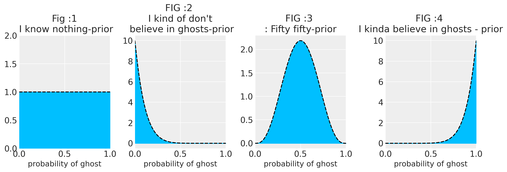
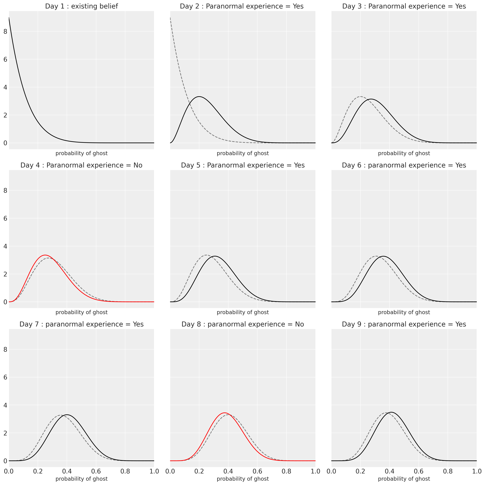
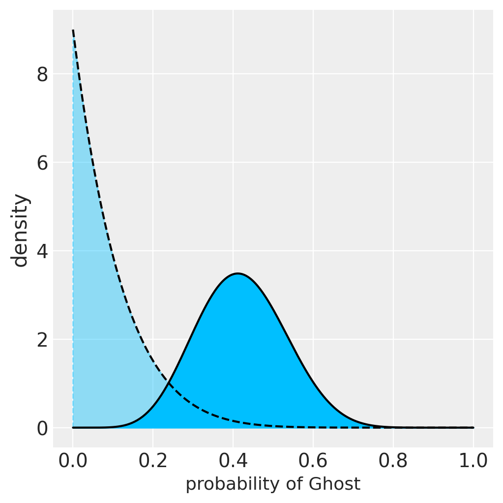

# Context

Each of us holds a set of beliefs that we have developed through our experiences. Every time we have to make a decision, we tend to base it on those belief i.e. our attitude towards the world at that given time. Time here is a very important dimension because with time we update our beliefs. Although the ability to always search for the motivation to change/update self-beliefs are important for us to make a better decision yet human factors like ego, blind superstition, etc comes as a tyrannical force to prevent us from changing or updating our self-beliefs.

Karl Popper refers to this occurrence as the [Idea of Falsification](https://en.wikipedia.org/wiki/Falsifiability) and we believe that changing your beliefs is the new approach to conducting science. For instance, our previous view regarding the form of the Earth was that it was flat, but with the advent of new scientific tools, we can today conclude that it is roughly a sphere. The point is that even if the world was thought to be flat at the time, we nevertheless built roads, railroads, and other infrastructures given that belief. Therefore, we cannot hold individuals who held this notion responsible as it was still a useful belief at that given time. And later we updated our beliefs, and maybe in the future from a different dimension (if exists) Earth’s form can be different from the sphere.

# Quantifying and Updating Beliefs (Bayesian formula) 

$$ P(\theta|evidence)=\frac{P(\theta)*P(evidence|\theta)}{P(evidence)} $$

If you peek at the right side of our equation; this side incorporates both
our existing beliefs and the likelihood of the evidence (data);  $$P(\theta)$$ is our existing belief on $$ \theta $$ which is called a Prior and P($$ evidence|\theta  ) $$ is our likelihood of the evidence. Thus the left side P( $$ \theta| evidence $$ )is our updated belief on $$ \theta $$ . For instance, back to the above analogy; $$ \theta $$  can be the believed form of the Earth today.

## Updating Beliefs about Ghost!! Just a toy example

### Scenario
Assume you are moving into a new home; this is how the opening scene of the majority of horror films starts. You had some strange experiences and made the decision to keep watch every night for a few days to see what would happen.
But how could we reflect these prevailing notions  mathematically; Using Bayesian approach, the unknown probability of ghost(p) would be treated as a random variable and given a distribution.Let's plot some of the Prior beliefs before we discuss its underlying distributions.

  

*Fig: Prior Distributions*
 
 
 
The above plots are some of our prior distribution which will be explained below, the shaded region indicates that the mass of probability is in that region.

Prior from **Fig 1 (first from the left)** implies that I am new to the planet or that I have no awareness of these phenomena because no one has ever told me about them. The first prior is hence neutral and any chances from 0 to 1 is equally likely. However, we can do better because we all have some beliefs about the ghost; the rest of these priors suggest that we all hold certain beliefs about ghosts and their existence.

Prior from **Fig 2 (second from the left)** suggests that I am more like to believe that ghosts don't exist; there are, however, some odds of ghosts.

Similarly, Prior from ** Fig 3** suggests that there is a 50/50 possibility of ghost.

Prior from **Fig 4** suggests that "I have greater beliefs on ghosts," but I'm not sure.

*Note:* This is just a part of an imaginary exercise; if you are doing a generalizable study you would want to use priors based on some scientific theory or an existing experiment. Or any other priors depending upon the type of your study. 

## Bayesian Updating

Moving on with "I kind of don't believe in ghosts"(second from the left).
This suggests that the existence of ghosts (p=1) is extremely implausible and the absence of ghosts (p=0) is extremely likely. This does not indicate that there is no chances of ghost,just because the absence of ghosts (p=0) is quite likely. It only suggests that the existence of ghosts (p=1) is exceedingly improbable.

Let's now enter the monitoring phase and begin gathering and documenting each of our paranormal encounters. Every day is like flipping a coin (Bernoulli trials): if we experience some paranormal activity, we record 1; otherwise, we record 0.  See the mathematical instructions at the end of the article.

 

*Fig: Updating our Beliefs*

We begin with our preexisting belief about the ghost; if we have any paranormal experiences, such as discovering someone under the bed, we then shift our beliefs to the right (p=1), but because it is a bayesian shift, we obtain the full distribution. For instance, on Day 2, the dashed distribution represents our prior distribution whereas the solid-line distribution represents our updated belief also as known as Posterior distribution. But an intriguing fact is that we will use this posterior distribution as our prior distribution on day 3 while we monitor the data and revise our opinions.

## Change In beliefs

The process of updating continues until day 9, which is the present. Using the same Bayesian formula we previously encountered, we compute our posterior distribution for every day.

 

*Fig: Updated Beliefs*

The black dotted distribution reflects our initial prior belief regarding ghosts; however, the black solid line shows our current beliefs, which lean more toward a 50/50 . Our understanding of the ghost has been updated as a result of our experience, and based on the updated distribution, it appears that it is time to call the priests.

These systems for updating beliefs are hardwired into our brain. This is how we form an opinion on something too, The more strongly we feel about some opinion, the more difficult it is to change our minds. Even though this occurs automatically inside our brains, teaching it to our computers—is a little more tricky. The codes are available on request but the underlying mathematics are explained next. 

## Math Section

Although there are many methods for computing posterior distribution (updated belief), at its heart, it just uses the Bayesian formula that we had previously explained. At Wiseyak we use different approaches like sampling, analytical solutions and quadratic approximations depending upon the complexity of the problem.  Here, we are computing the posterior, or the updated beliefs, using an analytical solution (Beta-Bernoulli Conjugacy).

Since everything that can be expressed mathematically can be coded into computers, we will attempt to express our beliefs through mathematical expressions.

 
 
### Beta-Bernoulli conjugacy

Using Bayesian Formula;
$$P(p|X)=\frac{P(p)*P(X|p)}{P(p)} \quad \quad \quad \text{[X here is observed data]}$$ 

We are interested in $$P(p|X)$$ which is our posterior distribution i.e probability of (p) that there is a ghost given the data (X) where X can take value either 0 or 1. 

Defining our Prior and Likelihoods:

$$ P(p)\sim Beta(\alpha,\beta) \quad \quad \quad \text{[Prior]}$$

$$p \sim \frac{p^{\alpha-1} *(1-p)^{\beta-1}}{B(\alpha,\beta)} $$

$$ B(\alpha,\beta) $$ is a constant and it does not depend on p we can remove it from the equation

$$f(\theta) = {p^{\alpha-1} *(1-p)^{\beta-1}} $$

Now we define our likelihood; where X is the random Variable that can take values X can take values either of {0,1}.

$$P(X|p) \sim Bernoulli(p) \quad \quad \quad \text{[ Bernoulli likelihood]} $$

$$P(X|p) \sim \theta^{x} (1-\theta)^{1-x}$$

Since, we have everything we need; plugging the values in above formula;
$$ P(p|X)=\frac{P(p)*P(X|p)}{P(p)} $$ 
$$ P(\theta|X)= \theta^{(\alpha + x)-1} (1-p)^{(\beta-x)-1} $$

let,$$\alpha'=\alpha + k$$ and $$\beta'=\beta-k$$;

$$P(\theta|X)= \theta^{\alpha'} (1-\theta)^{(\beta+n-x)-1} $$

using proportionality of equations
$$P(\theta|X) = \frac{\theta^{(\alpha + x)-1} (1-p)^{(\beta+n-x)-1}}{B(\alpha',\beta')} \quad \quad \quad \text{[Updated Belief]}$$

$$P(\theta|X) =Beta(\alpha',\beta') \quad \quad \quad \text{[which is also a Beta Distribution]}$$

